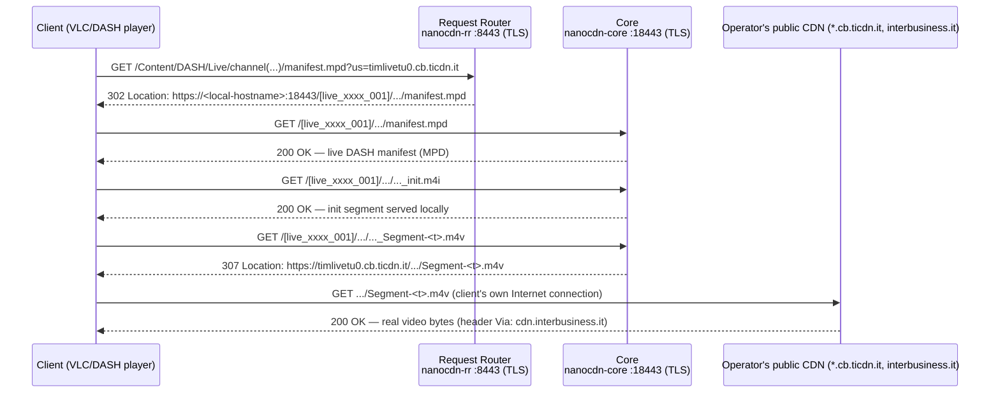

# XUPnP / xupnpd — UPnP/DLNA IPTV relay for clients without multicast support (e.g. Fire TV Stick)

Done on an already-rooted DGA4130/VBNT-K unit (modgui/Ansuel), with the goal
of having an IPTV decoder/relay reachable by a UPnP/DLNA client behind the
modem (typically a Fire TV Stick, which has no native support for the IPTV
multicast many ISPs use to distribute channels).

## 1. The "installed" flag bug in modgui's App Store

The modgui panel (`http://<router>:4044/ui/` once installed) offers XUPnP as
an installable app in its built-in "App Store". If the install is triggered
and the download fails, **the UCI flag stays stuck at "installed" anyway** —
a real bug, not specific to this unit: see
[Ansuel/tch-nginx-gui#940](https://github.com/Ansuel/tch-nginx-gui/issues/940)
for an identical report on another DGA4130.

Root cause: `app_xupnp()` in
`/usr/share/transformer/scripts/appInstallRemoveUtility.sh` runs
`opkg install xupnpd` and sets `modgui.app.xupnp_app="1"` **without checking
the command's exit status**. Fix and instructions:
[`xupnpd-iptv/appInstallRemoveUtility.sh.patch.md`](xupnpd-iptv/appInstallRemoveUtility.sh.patch.md).

## 2. The `xupnpd` package can no longer be obtained from any known opkg feed

Unlike most other modgui apps, `xupnpd` **is not part of Ansuel's generic
`GUI_ipk` feed** (checked the `base/`, `packages/`, `routing/`, `telephony/`,
`target/packages/` folders on the `kernel-4.1` branch, which otherwise
matches this router family's kernel 4.1.52). The community repos that used
to serve it (`repository.ilpuntotecnico(eadsl).com/.../roleo/public/agtef/...`)
are both offline. Even the project's own site (`xupnpd.org`) has expired and
is now squatted by an unrelated third party — **don't trust links found
there**.

The only remaining path is compiling xupnpd from the official source:
[clark15b/xupnpd](https://github.com/clark15b/xupnpd) (C++ core + embedded
Lua 5.3, no releases published, source only).

## 3. Cross-compiling for this router's exact ABI

The target ABI is **not** the obvious one: despite having a VFP-capable
Cortex-A9 CPU, this OpenWrt/TCH build uses **soft-float**, not hard-float.
Confirmed by pulling `/bin/busybox` off the router and inspecting it with
`readelf -A` / `readelf -h`:

```
ELF 32-bit LSB executable, ARM, EABI5 version 1 (SYSV) ...
Flags: 0x5000200, Version5 EABI, soft-float ABI
```

dynamic userland, but on **glibc 2.27** (old, 2018).

Toolchain issues hit, in order:

1. **Bootlin no longer ships a standalone soft-float `armv7-eabi` toolchain**
   — only `armv7-eabihf` (hard-float), which would crash on any floating
   point operation on this router (different calling convention). Used
   Debian's `gcc-arm-linux-gnueabi` / `g++-arm-linux-gnueabi` /
   `libc6-dev-armel-cross` instead (armel = soft-float, the right ABI).
2. Debian's cross-toolchain ships **glibc 2.41** for the target — too new to
   dynamically link against the router's 2.27 safely (real risk of
   `GLIBC_2.3x not found` at runtime). **Fix: static linking**
   (`-static -marm -march=armv7-a -mfloat-abi=soft`), which removes the
   runtime glibc dependency entirely — see
   [`xupnpd-iptv/Makefile.armel-tim`](xupnpd-iptv/Makefile.armel-tim). Known
   side effect: `dlopen`/`gethostbyname` remain fragile in a static glibc
   binary (link-time warnings), so hostname-based DNS resolution inside the
   binary may not be reliable — not an issue for IP/multicast relay, which
   is the primary use case.
3. xupnpd's `rules.mk` expects the Lua directory (`lua-5.3.5/`) to contain
   Lua's `.c` sources directly, not a full tarball extraction with its own
   `src/` subdir. Needs flattening one level:
   `mv lua-5.3.5/src/* lua-5.3.5/ && rmdir lua-5.3.5/src` before building,
   otherwise `make -C lua-5.3.5 a` fails with "No rule to make target 'a'".

## 4. Deploying to the router

Copied the whole runtime tree — not just the binary and the app's `.lua`
files, but also `www/`, `ui/`, `plugins/`, `profiles/`, `config/` from the
built repo — to **`/opt/xupnpd`, on USB storage** (not the internal overlay,
which on these routers typically only has a few dozen MB free).

Watch out: `xupnpd.lua` must start with `cfg={}` and end with
`dofile('xupnpd_main.lua')` — that line is what actually starts the server.
A first attempt with a hand-trimmed config missing both lines crash-looped
under procd
(`xupnpd.lua:2: attempt to index a nil value (global 'cfg')`). Always start
from the upstream template and only change what's needed — see
[`xupnpd-iptv/xupnpd.lua.example`](xupnpd-iptv/xupnpd.lua.example) for the
lines that actually need changing (LAN interface, IPTV multicast interface,
HTTP port).

procd service: [`xupnpd-iptv/xupnpd.init`](xupnpd-iptv/xupnpd.init)
(`/etc/init.d/xupnpd`, starts automatically on boot).

To keep modgui's App Store consistent with reality:

```sh
ln -sfn /opt/xupnpd /usr/share/xupnpd   # 04_config.sh detects the app from this dir
uci set modgui.app.xupnp_app=1
uci commit modgui
```

## 5. Verification

```sh
curl -s -D - -o /dev/null http://<router-ip>:4044/
# HTTP/1.1 301 Moved Permanently
# Server: eXtensible UPnP agent
# Location: ui/
curl -s -o /dev/null -w "HTTP %{http_code}\n" http://<router-ip>:4044/ui/
# HTTP 200
```

Note: the service binds to the LAN bridge's IP (`br-lan`), not
`127.0.0.1` — a local `curl` on the router itself needs to target the LAN
IP, not loopback.

## 6. From an empty player to the operator's real channel catalog (Broadpeak nanoCDN)

A freshly installed xupnpd is a UPnP/DLNA player with no content: it needs a
channel catalog. On this operator that catalog is not a static playlist: it
is generated live by the same Broadpeak nanoCDN stack
(`nanocdn-core`/`nanocdn-rr`, see
[`NETWORK-SECURITY-EN.md`](NETWORK-SECURITY-EN.md) §7) the router already
runs for the operator's own official decoder.

### 6.0 Overall architecture



Key points from the diagram:

- The router (Request Router + Core) is only involved for the manifest and
  the init segment — never for the heavy video-segment bytes, which are
  always a direct client↔public-CDN hop.
- The two chained TLS hops (`:8443` then `:18443`, both on the same router)
  are this architecture's main latency cost — relevant on a consumer-grade
  ARM router CPU, see §6.4.
- If the channel genuinely has an active multicast stream at that moment
  (not guaranteed: depends on the operator's schedule, see §6.5), the Core
  can answer segment requests from its own local buffer instead of
  redirecting to the CDN — the client doesn't need to tell the two cases
  apart, the protocol is identical either way.

### 6.1 The live catalog format

`nanocdn-core` receives, on the same multicast control channel documented in
§7 (`239.200.0.0:5004`, on the dedicated IPTV VLAN), a plain-text list,
refreshed periodically, with lines shaped like this:

```
<origin-cdn-host>/<channel-path>;mi=<multicast-ip>&mp=<port>&sri=<stream-name>&...&rto=<timeout>
```

`origin-cdn-host` is a hostname on the operator's own internal CDN (a domain
like `*.cb.<operator-cdn>.it`, or a third-party domain for content delivered
under partnership with an external provider), `mi`/`mp` are the matching
multicast stream's address/port, `sri` a session identifier. These
parameters have a short validity window: a stale catalog produces entries
that genuinely reach the operator's CDN but answer 404, because that
specific session no longer exists.

A small script that watches that file and turns it into an M3U playlist (one
`#EXTINF` line plus the origin URL, verbatim) covers the simple case — just
reference it in the `playlist={}` table of this repo's
[`xupnpd.lua.example`](xupnpd-iptv/xupnpd.lua.example). The tricky part is
that it needs to be **regenerated continuously**, not read once at boot.

### 6.2 The real endpoint official clients use: a fixed hostname + a "us=" parameter

A reasonable but wrong first guess: that the official decoder requests the
catalog's hostnames directly, and that resolving them locally to the
router's own IP is enough to intercept them. **It isn't.** Verified live
(by capturing detailed application logs on both the router side and the
player side) that the official decoder/app instead contacts a **fixed
hostname, identical for every channel**: `localdevice.abrstream.tech`. This
isn't a custom domain specific to this install — it's already present in
the operator's own stock firmware as a "local hostname" entry of its own
`dnsmasq` (`list hostname 'localdevice.abrstream.tech'` in
`/etc/config/dhcp`, the same mechanism the router uses to answer to its own
management name, e.g. `dsldevice`), but on this unit it was **never exposed
on the DNS resolver LAN clients actually query** (here that's a
third-party resolver the user installed, not `dnsmasq` — always verify with
`netstat -tlnp | grep :53` who really answers on the LAN IP before assuming
a DNS entry "already exists and works").

The request must be made over **HTTPS to that hostname**, on the Request
Router's SSL port (library default: **8443**), with a
`us=<channel-origin-hostname>` query parameter stating WHICH catalog
hostname is being targeted — the `Host:` header alone is not enough, `us=`
is required explicitly. The Request Router replies with a `302` redirect
to `nanocdn-core` itself, on ITS OWN SSL port (default `18443`, same
hostname), with a path tagged by a freshly generated session id; from there
the live manifest is served locally, and individual segment requests are
themselves redirected (`307`) to the original public CDN hostname — which
the **client** reaches with its own Internet connection, not the router.

In practice, for each catalog line (format described in §6.1: everything
before the first `;` is the original host+path+query, the rest is internal
multicast metadata), the useful URL for a generic player becomes:

```
https://localdevice.abrstream.tech:8443/<channel-path>[?original-query]&us=<channel-origin-host>
```

Concrete example, free/promotional channel (catalog line:
`timlivetu0.cb.ticdn.it/Content/DASH/Live/channel(timvisionpromo1)/manifest.mpd;mi=...`):

```
https://localdevice.abrstream.tech:8443/Content/DASH/Live/channel(timvisionpromo1)/manifest.mpd?us=timlivetu0.cb.ticdn.it
```

See §6.6 for this example's full live-captured request/response trace.

### 6.3 Correction: not a config/binary version mismatch, a port conflict

An earlier investigation in this repo (see §7 of
[`NETWORK-SECURITY-EN.md`](NETWORK-SECURITY-EN.md)) attributed
`nanocdn-rr`'s bind failure with `--conf` to a mismatch between the config
version (updated remotely via ACS/CWMP) and the installed binary's version.
**Digging further, that theory turned out to be wrong.** The real cause is
a plain **port conflict**: with `ssl-enabled=1` (always present in the
shared config), `nanocdn-rr` tries to bind its default HTTPS port
(**8443**), which on an install with an nginx-based admin GUI often
coincides with a port already used by the GUI's own
"assistance"/remote-management mode.

The dozens of `unknown option` lines in the logs remain cross-binary noise
(each binary logs the other's options, present in the same shared file),
not the cause of the failure.

**Verified fix**: move the conflicting service (in the case observed, the
nginx assistance GUI) to a different port, freeing up 8443 for
`nanocdn-rr`; then restart it with the **full original config**
(no need to strip the SSL lines — a free port was all it took), setting
`ssl-allow-self-signed-cert=1` since no real operator-issued certificate is
available locally under `ssl-auth-path` — without this the SSL bind still
fails for lack of a valid certificate. The Request Router generates an
on-the-fly self-signed certificate acceptable to most players (VLC accepts
it with no extra configuration; browsers show a one-time security warning
to confirm on that domain).

### 6.4 Session stability: max bitrate and inactivity timeout

With the correct endpoint (§6.2) working, two symptoms tied to nanoCDN's
internal session bookkeeping show up, both fixable via configuration:

A live (DASH/HLS) player reloads its manifest every few seconds to stay
close to the live edge. **Every manifest reload through the Request Router
mints a brand-new session on the Core**, while the player keeps downloading
video segments referencing the previous session's id for a while. This
produces two possible failure modes depending on how
`max-output-bitrate` and `inactive-sessions-timeout` (core section of the
config file) are set:

- **Timeout too long / max bitrate too low**: the "ghost" sessions created
  on every manifest refresh all stay "active" for the timeout's duration,
  and the sum of the max bitrate each one reserves (even though no real
  video byte ever actually crosses the router, since segments are always
  redirected to the public CDN for channels with no active multicast
  buffer) quickly exceeds the configured ceiling — the Request Router then
  rejects **every** new request with an explicit "bitrate too high"-style
  error, until the old sessions expire.
- **Timeout too short** (e.g. lowered to fight the symptom above): the
  previous session, the one the player is still downloading segments from,
  gets closed server-side ("reconnect timeout") before the player finishes
  consuming it. The player detects the resulting HTTP error and correctly
  reloads the manifest from scratch, but the new session's timeline
  reference doesn't line up smoothly with the one that just got cut off —
  a compliant player notices this (a buffer timestamp that looks "too
  old"), discards everything and restarts buffering from zero: visible as
  a full playback stop/restart every one to a few minutes.

**Fix**: raise **both** values together, not just one. A much higher max
bitrate ceiling than the factory default (that quota is sized for a box
that's the sole real video source, not one bouncing real playback off to
the Internet) removes the first symptom; a generous inactivity timeout
(well above the interval between a real player's manifest polls) removes
the second, without bringing back the first thanks to the now amply
sufficient bandwidth ceiling.

### 6.5 Known limitation: paid content (authentication required)

Channels that require a subscriber-level authentication token (not just an
operator-internal channel/event identifier) always fail at the Core's own
upstream fetch step with a `401 Unauthorized` from the real content
provider's server, regardless of everything above: the operator's
multicast catalog only carries channel/session identifiers, never the
credential a paid content provider's own CDN requires. Free/promotional
channels work fine through this mechanism; paid ones don't, and no
workaround at this layer is known.

### 6.6 End-to-end worked example (live-captured trace, free channel)

Initial request to the Request Router:

```
$ curl -sk -D - "https://localdevice.abrstream.tech:8443/Content/DASH/Live/channel(timvisionpromo1)/manifest.mpd?us=timlivetu0.cb.ticdn.it"

HTTP/1.1 302 Moved Temporarily
Access-Control-Allow-Origin:*
Access-Control-Expose-Headers: Location, X-BPK-ERROR
Location: https://localdevice.abrstream.tech:18443/[live_316674ea_6aa5cded_026]/Content/DASH/Live/channel(timvisionpromo1)/manifest.mpd
```

The client follows the redirect to the Core, on its SSL port:

```
$ curl -sk -D - "https://localdevice.abrstream.tech:18443/[live_316674ea_6aa5cded_026]/Content/DASH/Live/channel(timvisionpromo1)/manifest.mpd"

HTTP/1.1 200 OK
Content-Type: application/dash+xml
Via: http/1.1 se-mi1-17.cdn.interbusiness.it (), http/1.1 se-mo1-4.cdn.interbusiness.it ()

<?xml version="1.0" encoding="UTF-8" ?>
<MPD profiles="urn:mpeg:dash:profile:isoff-live:2011" type="dynamic"
     minimumUpdatePeriod="PT1.92S" suggestedPresentationDelay="PT1.92S"
     timeShiftBufferDepth="PT2M" ...>
  <Period start="PT0S" id="1">
    <AdaptationSet mimeType="video/mp4" ...>
      <SegmentTemplate timescale="10000000"
          media="$RepresentationID$_Segment-$Time$.m4v"
          initialization="$RepresentationID$_init.m4i">
        <SegmentTimeline><S t="53175241878241" d="19200000" r="62" /></SegmentTimeline>
      </SegmentTemplate>
      <Representation width="1920" height="1080" bandwidth="7000000" id="...item-08item" />
      <!-- 7 more renditions, from 384x216/350kbps to 1920x1080/7Mbps -->
    </AdaptationSet>
    <AdaptationSet mimeType="audio/mp4" ...>
      <Representation audioSamplingRate="48000" bandwidth="191000" id="...item-09item" />
    </AdaptationSet>
  </Period>
</MPD>
```

The `Via:` header shows the manifest genuinely comes from the operator's
own backbone (`cdn.interbusiness.it`), not a static local buffer — direct
proof the real-CDN fetch/relay works when done the right way.

Init segment (served locally by the Core, no redirect):

```
$ curl -sk -D - "https://localdevice.abrstream.tech:18443/[live_..._026]/Content/DASH/Live/channel(timvisionpromo1)/...item-08item_init.m4i"

HTTP/1.1 200 OK
Content-Type: video/mp4
Cache-Control: max-age=3600, public
```

Real video segment (redirected to the public CDN, the client downloads it
with its own Internet connection):

```
$ curl -sk -D - "https://localdevice.abrstream.tech:18443/[live_..._026]/.../...item-08item_Segment-53175241878241.m4v"

HTTP/1.1 307 Temporary Redirect
Location: https://timlivetu0.cb.ticdn.it/Content/DASH/Live/channel(timvisionpromo1)/...item-08item_Segment-53175241878241.m4v
```

Counter-example: same request scheme, but on a paid channel — the Core
(§6.5) forwards the request to the real content provider, which rejects it
for lacking a valid subscription token:

```
$ curl -sk "https://localdevice.abrstream.tech:8443/.../stream.mpd?us=dca-tm-livedazn.dazn.ticdn.it&channel=5067&outlet=dazn-italy" -D -

HTTP/1.1 503 Service Unavailable
X-BPK-ERROR: 3601 - Unicast server replies an error without explanation
```

(in the Core's own application log, the real upstream error is visible in
full: `httpc reply error: 401`).

## Next steps (not covered here)

- Set up a UPnP/DLNA client on the device that will play the channels (e.g.
  BubbleUPnP or VLC on a Fire TV Stick).
