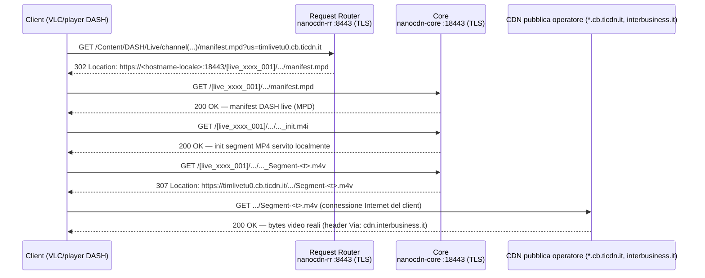

# XUPnP / xupnpd — relay UPnP/DLNA IPTV per client senza multicast (es. Fire TV Stick)

Scritto su un'unità DGA4130/VBNT-K già rootata (modgui/Ansuel), con l'obiettivo
di avere un decoder/relay IPTV raggiungibile da un client UPnP/DLNA dietro il
modem (tipicamente una Fire TV Stick, che non supporta nativamente il
multicast IPTV che molti ISP usano per distribuire i canali).

## 1. Il bug del flag "installato" nell'App Store di modgui

Il pannello modgui (`http://<router>:4044/ui/` una volta installato) offre
XUPnP come app installabile dall'"App Store" integrato. Se l'installazione
viene avviata e il download fallisce, **il flag UCI resta comunque impostato
su "installato"** — bug reale, non specifico di questa unità: vedi
[Ansuel/tch-nginx-gui#940](https://github.com/Ansuel/tch-nginx-gui/issues/940)
per un report identico su un altro DGA4130.

Causa: `app_xupnp()` in
`/usr/share/transformer/scripts/appInstallRemoveUtility.sh` esegue
`opkg install xupnpd` e imposta `modgui.app.xupnp_app="1"` **senza controllare
l'esito** del comando. Fix e istruzioni: [`xupnpd-iptv/appInstallRemoveUtility.sh.patch.md`](xupnpd-iptv/appInstallRemoveUtility.sh.patch.md).

## 2. Il pacchetto `xupnpd` non è più ottenibile da nessun feed opkg noto

A differenza di molte altre app di modgui, `xupnpd` **non fa parte del feed
generico Ansuel `GUI_ipk`** (verificato sulle cartelle `base/`, `packages/`,
`routing/`, `telephony/`, `target/packages/` del branch `kernel-4.1`, che
altrimenti combacia con il kernel 4.1.52 di questa famiglia di router). I
repository comunitari che un tempo lo distribuivano
(`repository.ilpuntotecnico(eadsl).com/.../roleo/public/agtef/...`) sono
entrambi offline. Anche il sito ufficiale del progetto (`xupnpd.org`) è
scaduto ed è stato occupato da un sito di terze parti non correlato —
**non fidarsi di link trovati lì**.

L'unica strada rimasta è compilare xupnpd dal sorgente ufficiale:
[clark15b/xupnpd](https://github.com/clark15b/xupnpd) (C++ + Lua 5.3
incorporato, nessuna release pubblicata, solo sorgente).

## 3. Cross-compilazione per l'ABI esatta di questo router

L'ABI del target **non** è quella "ovvia": pur avendo una CPU Cortex-A9
(capace di VFP), questa build OpenWrt/TCH usa **soft-float**, non hard-float.
Verificato scaricando `/bin/busybox` dal router e ispezionandolo con
`readelf -A` / `readelf -h`:

```
ELF 32-bit LSB executable, ARM, EABI5 version 1 (SYSV) ...
Flags: 0x5000200, Version5 EABI, soft-float ABI
```

userland dinamico ma con **glibc 2.27** (vecchia, 2018).

Toolchain e problemi incontrati, in ordine:

1. **Bootlin non distribuisce più un toolchain `armv7-eabi` (soft-float)**
   standalone — solo `armv7-eabihf` (hard-float), che su questo router
   crasherebbe su qualunque operazione floating point (convenzione di
   chiamata diversa). Usato invece il pacchetto Debian
   `gcc-arm-linux-gnueabi` / `g++-arm-linux-gnueabi` / `libc6-dev-armel-cross`
   (armel = soft-float, corretto).
2. Il toolchain Debian porta **glibc 2.41** per il target — troppo recente
   per il linking dinamico contro la 2.27 del router (rischio concreto di
   `GLIBC_2.3x not found` a runtime). **Fix: link statico**
   (`-static -marm -march=armv7-a -mfloat-abi=soft`), che elimina del tutto
   la dipendenza da una glibc runtime — vedi
   [`xupnpd-iptv/Makefile.armel-tim`](xupnpd-iptv/Makefile.armel-tim).
   Effetto collaterale noto: `dlopen`/`gethostbyname` restano fragili in un
   binario glibc statico (warning al link), quindi la risoluzione DNS per
   nome host nel binario potrebbe non essere affidabile — non un problema
   per il relay via IP/multicast, che è l'uso primario.
3. Il `rules.mk` di xupnpd si aspetta che la cartella Lua (`lua-5.3.5/`)
   contenga direttamente i sorgenti `.c` di Lua, non l'estrazione completa
   del tarball con un proprio `src/`. Serve appiattire di un livello:
   `mv lua-5.3.5/src/* lua-5.3.5/ && rmdir lua-5.3.5/src` prima della build,
   altrimenti `make -C lua-5.3.5 a` fallisce con "No rule to make target 'a'".

## 4. Deploy sul router

Copiato l'intero albero runtime — non solo il binario e i file `.lua`
dell'app, ma anche `www/`, `ui/`, `plugins/`, `profiles/`, `config/` dal
repo compilato — su **`/opt/xupnpd`, su storage USB** (non sull'overlay
interno, che su questi router ha tipicamente solo poche decine di MB
liberi).

Attenzione: `xupnpd.lua` deve iniziare con `cfg={}` e terminare con
`dofile('xupnpd_main.lua')` — è quella riga che avvia davvero il server.
Un primo tentativo di configurazione "ritagliata a mano" senza queste due
righe ha prodotto un crash-loop sotto procd
(`xupnpd.lua:2: attempt to index a nil value (global 'cfg')`). Partire
sempre dal template upstream e modificare solo le righe necessarie — vedi
[`xupnpd-iptv/xupnpd.lua.example`](xupnpd-iptv/xupnpd.lua.example) per le
righe che vanno effettivamente cambiate (interfaccia LAN, interfaccia
multicast IPTV, porta HTTP).

Servizio procd: [`xupnpd-iptv/xupnpd.init`](xupnpd-iptv/xupnpd.init)
(`/etc/init.d/xupnpd`, avvio automatico al boot).

Per mantenere coerente l'App Store di modgui con lo stato reale:

```sh
ln -sfn /opt/xupnpd /usr/share/xupnpd   # 04_config.sh rileva l'app da questa dir
uci set modgui.app.xupnp_app=1
uci commit modgui
```

## 5. Verifica

```sh
curl -s -D - -o /dev/null http://<router-ip>:4044/
# HTTP/1.1 301 Moved Permanently
# Server: eXtensible UPnP agent
# Location: ui/
curl -s -o /dev/null -w "HTTP %{http_code}\n" http://<router-ip>:4044/ui/
# HTTP 200
```

Nota: il servizio si lega all'IP della LAN bridge (`br-lan`), non a
`127.0.0.1` — un `curl` da locale sul router va indirizzato all'IP LAN, non
al loopback.

## 6. Dal player vuoto al catalogo canali reale (Broadpeak nanoCDN)

Un xupnpd appena installato è un player UPnP/DLNA senza contenuti: serve un
catalogo canali. Su questo operatore quel catalogo non è una playlist
statica: è generato in tempo reale dallo stesso stack Broadpeak nanoCDN
(`nanocdn-core`/`nanocdn-rr`, vedi
[`NETWORK-SECURITY-IT.md`](NETWORK-SECURITY-IT.md) §7) che il router usa già
per il decoder ufficiale dell'operatore.

### 6.0 Architettura d'insieme



Punti chiave del diagramma:

- Il router (Request Router + Core) interviene **solo** per manifest e init
  segment — mai per i byte video pesanti dei segmenti, che restano sempre
  un salto diretto client↔CDN pubblica.
- I due hop TLS in cascata (`:8443` poi `:18443`, entrambi sullo stesso
  router) sono il costo di latenza principale di questa architettura —
  rilevante se il router è una CPU ARM di fascia consumer, vedi §6.4.
- Se il canale ha davvero un flusso multicast attivo in quel momento (non
  garantito: dipende dal palinsesto dell'operatore, vedi §6.5), il Core può
  rispondere ai segmenti dal proprio buffer locale invece che reindirizzare
  alla CDN — il client non deve distinguere i due casi, il protocollo è
  identico.

### 6.1 Il formato del catalogo live

`nanocdn-core` riceve sullo stesso control channel multicast documentato in
§7 (`239.200.0.0:5004`, sulla VLAN IPTV dedicata) un elenco testuale,
aggiornato periodicamente, con righe in questo schema:

```
<host-cdn-origine>/<path-canale>;mi=<ip-multicast>&mp=<porta>&sri=<nome-flusso>&...&rto=<timeout>
```

`host-cdn-origine` è un hostname della CDN interna dell'operatore (dominio
del tipo `*.cb.<cdn-operatore>.it`, oppure un dominio di terze parti per
contenuti in partnership con provider esterni), `mi`/`mp` sono
indirizzo/porta del flusso multicast corrispondente, `sri` un identificativo
di sessione. Questi parametri hanno una finestra di validità breve: un
catalogo non aggiornato produce entry che raggiungono davvero la CDN
dell'operatore ma rispondono 404, perché quella sessione specifica non
esiste più.

Un piccolo script che tiene d'occhio quel file e lo traduce in una playlist
M3U (una riga `#EXTINF` più l'URL origine, verbatim) copre il caso semplice:
basta referenziarla nella tabella `playlist={}` del
[`xupnpd.lua.example`](xupnpd-iptv/xupnpd.lua.example) di questo repo. Il
punto delicato è che va rigenerata di continuo, non letta una volta sola al
boot.

### 6.2 Il vero endpoint usato dai client ufficiali: hostname fisso + parametro "us="

Un'ipotesi iniziale ragionevole ma sbagliata: che il decoder ufficiale
richieda direttamente gli hostname del catalogo, e che basti risolverli
localmente all'IP del router per intercettarli. **Non è così.** Verificato
dal vivo (catturando log applicativi dettagliati sia lato router sia lato
player) che il decoder/app ufficiale contatta invece un **hostname fisso e
identico per tutti i canali**: `localdevice.abrstream.tech`. Non è un
dominio custom di questa installazione — è già presente nel firmware
originale dell'operatore come voce "hostname locale" del proprio `dnsmasq`
(`list hostname 'localdevice.abrstream.tech'` in `/etc/config/dhcp`, lo
stesso meccanismo con cui il router risponde al proprio nome di gestione,
es. `dsldevice`), ma su questa unità **non era mai esposto sul resolver
DNS che i client LAN interrogano davvero** (qui è un resolver di terze
parti installato dall'utente, non `dnsmasq` — verificare sempre con
`netstat -tlnp | grep :53` chi risponde realmente sull'IP LAN prima di
assumere che una voce DNS "esista già e funzioni").

La richiesta va fatta in **HTTPS verso quell'hostname**, sulla porta SSL
del Request Router (default di libreria: **8443**), con un parametro
`us=<hostname-origine-canale>` in query string che indica QUALE hostname
del catalogo si vuole raggiungere — non basta l'header `Host:`, serve
esplicitamente `us=`. Il Request Router risponde con un redirect `302`
verso lo stesso `nanocdn-core`, sulla SUA porta SSL (default `18443`,
stesso hostname), con un path taggato da un ID di sessione generato al
volo; da lì il manifest live viene servito localmente, e le richieste dei
singoli segmenti video vengono a loro volta reindirizzate (`307`)
all'hostname CDN pubblico originale — che il **client** raggiunge con la
propria connessione Internet, non il router.

In pratica, per ogni riga del catalogo (formato descritto in §6.1: tutto
ciò che precede il primo `;` è host+path+query originali, il resto sono
metadati multicast interni), l'URL utile per un player generico diventa:

```
https://localdevice.abrstream.tech:8443/<path-canale>[?query-originale]&us=<host-origine-canale>
```

Esempio concreto, canale gratuito/promozionale (riga di catalogo:
`timlivetu0.cb.ticdn.it/Content/DASH/Live/channel(timvisionpromo1)/manifest.mpd;mi=...`):

```
https://localdevice.abrstream.tech:8443/Content/DASH/Live/channel(timvisionpromo1)/manifest.mpd?us=timlivetu0.cb.ticdn.it
```

Vedi §6.6 per la traccia completa richiesta/risposta di questo esempio, catturata dal vivo.

### 6.3 Correzione: non era un disallineamento di versione, era un conflitto di porta

Un'indagine precedente in questo repo (vedi §7 di
[`NETWORK-SECURITY-IT.md`](NETWORK-SECURITY-IT.md)) attribuiva il
fallimento di bind di `nanocdn-rr` con `--conf` a un disallineamento tra
la versione del config (aggiornato da remoto via ACS/CWMP) e quella del
binario installato. **Approfondendo ulteriormente, quella teoria si è
rivelata sbagliata.** La causa reale è un banale **conflitto di porta**:
con `ssl-enabled=1` (sempre presente nel config condiviso), `nanocdn-rr`
prova a bindare la sua porta HTTPS di default (**8443**), che su
un'installazione con GUI di amministrazione basata su nginx spesso
coincide con una porta già usata dalla modalità "assistenza"/gestione
remota della GUI stessa.

Le decine di `unknown option` nei log restano rumore incrociato
core/rr (ciascun binario logga le opzioni dell'altro, presenti nello
stesso file condiviso), non la causa del fallimento.

**Fix verificato**: spostare il servizio in conflitto (nel caso osservato,
la GUI di assistenza nginx) su una porta diversa, così da liberare la 8443
per `nanocdn-rr`; poi riavviarlo con la config **originale completa**
(non serve rimuovere le righe SSL: bastava la porta libera), impostando
`ssl-allow-self-signed-cert=1` dato che nessun certificato reale
dell'operatore è disponibile localmente in `ssl-auth-path` — senza questo,
il bind SSL fallisce comunque per mancanza di un certificato valido.
Il Request Router genera al volo un certificato self-signed accettabile
dalla maggior parte dei player (VLC lo accetta senza configurazione
aggiuntiva; i browser mostrano un avviso di sicurezza da confermare una
tantum sul dominio).

### 6.4 Stabilità delle sessioni: bitrate massimo e timeout di inattività

Con l'endpoint corretto (§6.2) funzionante, emergono due sintomi legati
alla gestione interna delle sessioni di nanoCDN, entrambi risolvibili via
configurazione:

Un player live (DASH/HLS) ricarica il manifest ogni pochi secondi per
restare vicino al bordo "live" dello stream. **Ogni ricarica del manifest
attraverso il Request Router genera una sessione nuova sul Core**, mentre
il player continua per un po' a scaricare i segmenti video referenziando
l'ID della sessione precedente. Questo produce due possibili guasti a
seconda di come sono impostati `max-output-bitrate` e
`inactive-sessions-timeout` (sezione core del file di configurazione):

- **Timeout troppo lungo / bitrate massimo troppo basso**: le sessioni
  "fantasma" createsi a ogni refresh del manifest restano tutte
  "attive" per la durata del timeout, e la somma del bitrate massimo che
  ciascuna riserva (anche se nessun byte video reale passa mai dal router,
  dato che i segmenti vengono sempre reindirizzati alla CDN pubblica per
  i canali senza buffer multicast attivo) supera rapidamente il tetto
  configurato — il Request Router rifiuta allora **ogni** nuova richiesta
  con un errore esplicito tipo "bitrate too high", finché le vecchie
  sessioni non scadono.
- **Timeout troppo corto** (es. abbassato per contrastare il sintomo
  sopra): la sessione precedente, quella da cui il player sta ancora
  scaricando segmenti, viene chiusa dal server ("reconnect timeout")
  prima che il player finisca di consumarla. Il player rileva l'errore
  HTTP risultante e ricarica correttamente il manifest da capo, ma la
  nuova sessione ha un riferimento temporale della timeline leggermente
  diverso da quella appena interrotta — un player conforme se ne accorge
  (buffer con timestamp "troppo vecchio"), scarta tutto e riparte da zero
  la bufferizzazione: visibile come un blocco/riavvio completo della
  riproduzione ogni uno-tre minuti.

**Fix**: alzare **entrambi** i valori insieme, non uno solo. Un tetto di
bitrate massimo molto più alto del previsto di fabbrica (quella quota è
pensata per un router che sia l'unica vera sorgente video, non per uno che
smista il traffico reale verso Internet) elimina il primo sintomo; un
timeout di inattività generoso (ben superiore all'intervallo tra due
refresh del manifest di un player reale) elimina il secondo, senza far
ritornare il primo grazie al tetto di banda ormai ampiamente sufficiente.

### 6.5 Limite noto: contenuti a pagamento (serve autenticazione)

I canali che richiedono un token di autenticazione legato a un vero
abbonamento (non un semplice identificativo di canale/evento interno
all'operatore) falliscono sempre al passo di fetch upstream del Core con
un `401 Unauthorized` dal server reale del fornitore di contenuti,
indipendentemente da tutto quanto sopra: il catalogo multicast
dell'operatore porta solo identificativi di canale/sessione, mai le
credenziali che la CDN del fornitore a pagamento richiede. I canali
gratuiti/promozionali funzionano regolarmente con questo meccanismo; quelli
a pagamento no, e non risulta un modo per aggirarlo a questo livello.

### 6.6 Esempio pratico end-to-end (traccia reale, canale gratuito)

Richiesta iniziale al Request Router:

```
$ curl -sk -D - "https://localdevice.abrstream.tech:8443/Content/DASH/Live/channel(timvisionpromo1)/manifest.mpd?us=timlivetu0.cb.ticdn.it"

HTTP/1.1 302 Moved Temporarily
Access-Control-Allow-Origin:*
Access-Control-Expose-Headers: Location, X-BPK-ERROR
Location: https://localdevice.abrstream.tech:18443/[live_316674ea_6aa5cded_026]/Content/DASH/Live/channel(timvisionpromo1)/manifest.mpd
```

Il client segue il redirect verso il Core, sulla sua porta SSL:

```
$ curl -sk -D - "https://localdevice.abrstream.tech:18443/[live_316674ea_6aa5cded_026]/Content/DASH/Live/channel(timvisionpromo1)/manifest.mpd"

HTTP/1.1 200 OK
Content-Type: application/dash+xml
Via: http/1.1 se-mi1-17.cdn.interbusiness.it (), http/1.1 se-mo1-4.cdn.interbusiness.it ()

<?xml version="1.0" encoding="UTF-8" ?>
<MPD profiles="urn:mpeg:dash:profile:isoff-live:2011" type="dynamic"
     minimumUpdatePeriod="PT1.92S" suggestedPresentationDelay="PT1.92S"
     timeShiftBufferDepth="PT2M" ...>
  <Period start="PT0S" id="1">
    <AdaptationSet mimeType="video/mp4" ...>
      <SegmentTemplate timescale="10000000"
          media="$RepresentationID$_Segment-$Time$.m4v"
          initialization="$RepresentationID$_init.m4i">
        <SegmentTimeline><S t="53175241878241" d="19200000" r="62" /></SegmentTimeline>
      </SegmentTemplate>
      <Representation width="1920" height="1080" bandwidth="7000000" id="...item-08item" />
      <!-- altre 7 rendition, da 384x216/350kbps a 1920x1080/7Mbps -->
    </AdaptationSet>
    <AdaptationSet mimeType="audio/mp4" ...>
      <Representation audioSamplingRate="48000" bandwidth="191000" id="...item-09item" />
    </AdaptationSet>
  </Period>
</MPD>
```

L'header `Via:` mostra che il manifest arriva realmente dalla dorsale
dell'operatore (`cdn.interbusiness.it`), non da un buffer statico locale —
prova diretta che il fetch/relay verso la CDN reale funziona quando fatto
nel modo corretto.

Init segment (servito localmente dal Core, nessun redirect):

```
$ curl -sk -D - "https://localdevice.abrstream.tech:18443/[live_..._026]/Content/DASH/Live/channel(timvisionpromo1)/...item-08item_init.m4i"

HTTP/1.1 200 OK
Content-Type: video/mp4
Cache-Control: max-age=3600, public
```

Segmento video reale (reindirizzato alla CDN pubblica, il client lo scarica
con la propria connessione Internet):

```
$ curl -sk -D - "https://localdevice.abrstream.tech:18443/[live_..._026]/.../...item-08item_Segment-53175241878241.m4v"

HTTP/1.1 307 Temporary Redirect
Location: https://timlivetu0.cb.ticdn.it/Content/DASH/Live/channel(timvisionpromo1)/...item-08item_Segment-53175241878241.m4v
```

Contro-esempio: stesso schema di richiesta, ma su un canale a pagamento —
il Core (§6.5) inoltra la richiesta al fornitore di contenuti reale, che
la rifiuta perché priva di token di abbonamento valido:

```
$ curl -sk "https://localdevice.abrstream.tech:8443/.../stream.mpd?us=dca-tm-livedazn.dazn.ticdn.it&channel=5067&outlet=dazn-italy" -D -

HTTP/1.1 503 Service Unavailable
X-BPK-ERROR: 3601 - Unicast server replies an error without explanation
```

(nel log applicativo del Core, l'errore upstream reale è visibile per
esteso: `httpc reply error: 401`).

## Passi successivi (non coperti qui)

- Configurare un client UPnP/DLNA sul dispositivo che deve riprodurre i
  canali (es. BubbleUPnP o VLC su Fire TV Stick).
